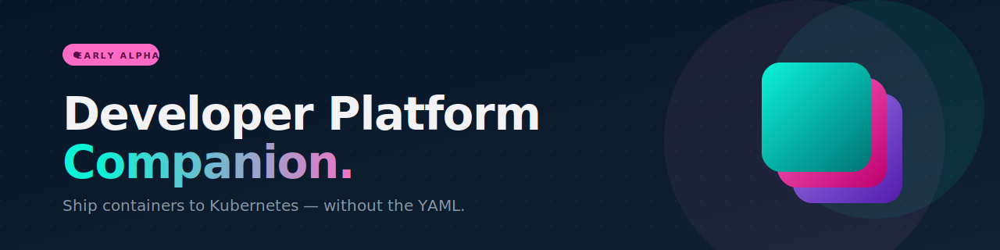

<p align="center">
  
</p>

<p align="center">
  <a href="https://github.com/intility/cust-devplatform-plugin/issues">
    
  </a>
  <a href="LICENSE">
    
  </a>
  
</p>

<p align="center">
  <strong>A Claude Code plugin that turns</strong> <em>"I have a Docker image"</em><br/>
  <strong>into</strong> <em>"my app is live at <code>https://myapp.apps.example.com</code>"</em>.<br/>
  <br/>
  No manifests to write. No YAML to memorize. No Kubernetes book on the shelf.
</p>

---

> ⚠️ **Early alpha.** This is the first cut of customer-facing skills for the Intility Developer Platform. Skill names, prompts, defaults, and behaviours will change as we learn. Don't depend on it for anything critical yet — but please [open an issue](https://github.com/intility/cust-devplatform-plugin/issues) when something feels off, surprises you, or could be clearer. That feedback is the whole point of an alpha.

## Features

- **Create a cluster** in one prompt — sensible defaults, no preset/zone/autoscaling questions
- **Deploy any container** — Claude writes the Namespace, Deployment, and Service for you
- **Real URLs via HTTPRoute** — `internal` by default, with an explicit security check before exposing anything publicly
- **Ship new versions safely** — `oc set image` with rollout watch and one-command rollback
- **See what's running** — a read-only status overview when you come back after a break
- **State-aware** — every skill detects where you are; no hidden memory to keep in sync

## Quick start

**1. Install the prerequisites**

- [`indev`](https://developers.intility.com) — the Intility Developer Platform CLI
- [`oc`](https://developers.intility.com) — the OpenShift CLI

**2. Install this plugin**

```bash
# If your team has the Intility marketplace configured:
/plugin marketplace add intility
/plugin install cust-devplatform-plugin@intility

# Or clone it directly:
git clone https://github.com/intility/cust-devplatform-plugin \
  ~/.claude/plugins/cust-devplatform-plugin
```

**3. Tell Claude what you want**

```
help me ship my app on Intility
```

That's the whole thing. The plugin detects where you are in the journey and walks you through the rest.

## A typical first session

```text
You:    I have a Node app, image is at ghcr.io/me/shop:v1. Get it running.

Claude: No cluster yet — I'll create one called 'shop' and log you in.
        [creates cluster, waits ~7 minutes, OAuth login]
        Ready. What port does your app listen on?

You:    3000

Claude: [generates k8s/shop/ manifests, applies them, waits for rollout]
        Pods are running. Want a URL?

You:    yes

Claude: [creates HTTPRoute on the internal gateway]
        Live at http://shop.apps.example.com — try it out.
```

## What's in the box

Eight composable skills. All are user-invocable, so you can ask for any of them directly — or just describe what you want and the right one runs.

<table>
  <thead>
    <tr><th>Skill</th><th>Use it when…</th></tr>
  </thead>
  <tbody>
    <tr><td><code>getting-started</code></td><td>You're new and don't know where to begin</td></tr>
    <tr><td><code>status</code></td><td>You're coming back and want to see what's running</td></tr>
    <tr><td><code>create-cluster</code></td><td>You need a cluster</td></tr>
    <tr><td><code>login</code></td><td>You need to (re)connect to a cluster</td></tr>
    <tr><td><code>prepare-app</code></td><td>You want to check your app is ready to deploy</td></tr>
    <tr><td><code>deploy-app</code></td><td>You're ready to put your app on the cluster</td></tr>
    <tr><td><code>expose-app</code></td><td>You want a URL that points to your app</td></tr>
    <tr><td><code>update-image</code></td><td>You've built a new version of your app</td></tr>
  </tbody>
</table>

## Design principles

A few intentional choices that shape how the plugin behaves:

- **One cluster, many namespaces.** Each app gets its own namespace on a shared cluster — no per-app cluster sprawl.
- **Manifests in your repo, applied directly.** No GitOps, no ArgoCD. `k8s/<app>/*.yaml` is the source of truth.
- **Safe by default.** `internal` gateway is the default; `public` requires an explicit two-step security confirmation.
- **Detect, don't assume.** Every skill queries the cluster (`oc whoami`, `indev cluster list`, …) at the start instead of carrying hidden state.
- **Friendly, not lecturing.** Show one command at a time. Introduce a term *after* you've shown what it does.

## Good to know

A few things that aren't obvious up front:

- **First run = clicking "Allow" a lot.** Claude Code asks permission the first time it runs each command. Allow them once and future sessions are quiet.
- **Tokens expire.** Both `indev` and `oc` log out after a few hours. If something fails with "Unauthorized", just say *"log me back in"*.
- **Different repo, different view.** Claude only sees the manifests in the directory you're working from. Switching repos means switching scope.
- **`update-image` keeps the local file in sync** — but only if you run it from the repo that contains the manifests. Otherwise, the YAML on disk will drift from the cluster.

## Found a bug? Have a wish?

Open an issue: **[github.com/intility/cust-devplatform-plugin/issues](https://github.com/intility/cust-devplatform-plugin/issues)**

Helpful to include:

- What you asked Claude to do
- What Claude tried (the failing command is the best clue)
- Cluster name, if relevant

For platform-level problems (cluster won't provision, gateways missing, can't log in at all), reach out to the **Developer Platform Admins** via your collaboration channel (samhandlingskanal).

## License

[MIT](LICENSE) — use it, fork it, ship it.

---

<p align="center">
  <sub>Built by Intility · Styled with <a href="https://bifrost.intility.com">Bifrost</a> · Powered by <a href="https://claude.com/claude-code">Claude Code</a></sub>
</p>
